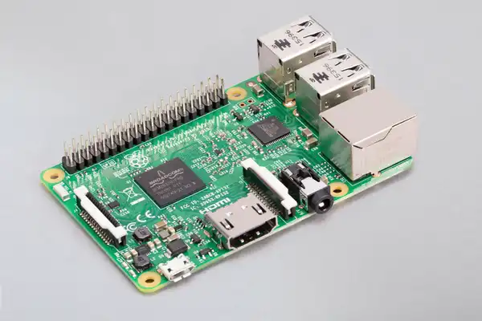

# Raspberry Pi 3 Model B – Hardware Documentation

## Overview

The Raspberry Pi 3 Model B is a low-cost, credit-card sized single board computer developed by the Raspberry Pi Foundation.  
It is widely used for embedded systems, IoT applications, education, and Linux-based development.

This document provides a clear and verified technical overview of the Raspberry Pi 3 board and its main hardware components.

---

## Board Specifications (Official)

| Feature | Description |
|-------|-------------|
| Processor | Broadcom BCM2837 |
| CPU | Quad-core ARM Cortex-A53, 64-bit |
| Clock Speed | 1.2 GHz |
| RAM | 1GB LPDDR2 |
| Wireless | 2.4 GHz Wi-Fi 802.11n |
| Bluetooth | Bluetooth 4.1|
| Ethernet | 10/100 Mbps Ethernet |
| USB Ports | 4 × USB 2.0 |
| Display Output | Full-size HDMI |
| Storage | microSD card slot |
| GPIO | 40-pin GPIO header |
| Camera Interface | CSI port |
| Display Interface | DSI port |
| Power Input | 5V via micro-USB |
| Audio | 3.5mm audio/video jack |

Source: https://www.raspberrypi.com/products/raspberry-pi-3-model-b/

---

## Hardware Components Explanation

### 1. Processor (BCM2837 SoC)

- The main processor used is **Broadcom BCM2837 System on Chip (SoC)**.
- Contains a **Quad-core ARM Cortex-A53 CPU**.
- Responsible for running the operating system and applications.
- Integrated with GPU and multimedia processing unit.

---

### 2. RAM

- Raspberry Pi 3 Model B has **1GB LPDDR2 RAM**.
- RAM is directly connected to the processor.
- Used for running programs, services, and the operating system.
- The memory is soldered on board and **cannot be upgraded**.

---

### 3. Power Supply System

- Powered using a **5V micro-USB input**.
- Recommended power supply: **5V, 2.5A**.
- Onboard power management circuitry distributes regulated power to:
  - CPU
  - USB devices
  - HDMI
  - GPIO peripherals

---

### 4. USB Subsystem

- Four USB 2.0 ports are available.
- Used for connecting:
  - Keyboard and mouse  
  - USB drives  
  - External peripherals  
- Controlled by an onboard USB hub controller.

---

### 5. Ethernet Interface

- Integrated **10/100 Mbps RJ45 Ethernet port**.
- Provides wired network connectivity.
- Useful for stable internet and LAN communication.

---

### 6. Wireless Connectivity

Raspberry Pi 3 has built-in wireless features:

- **Wi-Fi:** 802.11 b/g/n (2.4 GHz)
- **Bluetooth:** 4.1 and Bluetooth Low Energy (BLE)

This removes the need for external Wi-Fi or Bluetooth adapters.

---

### 7. HDMI Output

- Full-size HDMI port available.
- Supports:
  - Video output up to 1080p
  - Audio over HDMI
- Used to connect monitors and televisions.

---

### 8. microSD Storage

- Raspberry Pi does not contain internal storage.
- The operating system boots from a **microSD card**.
- All user data and system files are stored on the SD card.

---

### 9. GPIO (General Purpose Input Output)

- 40-pin GPIO header available.
- Used for interfacing:
  - Sensors  
  - LEDs  
  - Motors  
  - External hardware modules  

GPIO makes Raspberry Pi ideal for embedded and IoT projects.

---

### 10. Camera and Display Interfaces

- **CSI Port** – used to connect Raspberry Pi Camera Module.
- **DSI Port** – used to connect official Raspberry Pi Touch Display.

---

### 11. Audio and Video Jack

- 3.5mm jack supports:
  - Analog audio output  
  - Composite video output  

---

### 12. Status LEDs

- **PWR LED** – Indicates power status  
- **ACT LED** – Shows SD card activity  

These LEDs help in debugging boot and power-related issues.

---

## Typical Use Cases

- Embedded Linux development  
- IoT applications  
- Media centers  
- Home automation  
- Educational projects  
- Prototyping and hardware interfacing  

---

## References

- Raspberry Pi 3 Official Product Page:  
  https://www.raspberrypi.com/products/raspberry-pi-3-model-b/

- Raspberry Pi Hardware Documentation:  
  https://www.raspberrypi.com/documentation/

- BCM2837 ARM Processor Documentation:  
  https://www.raspberrypi.com/documentation/computers/processors.html

---
